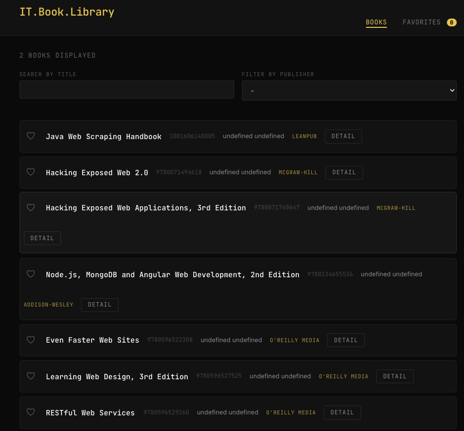

# 📚 IT Book Library

A sleek, dark-themed web app for browsing and managing your favorite programming books. Built with TypeScript, vanilla JS, and a custom CSS design system.



## ✨ Features

- **Book Grid** — Live search with case-insensitive filtering by title/author
- **Publisher Filter** — Dropdown to filter books by publisher (duplicates auto-removed)
- **Favorites** — Heart-button to save books, persisted in localStorage
- **Book Detail** — Click any book to see full info: ISBN, pages, price, abstract
- **Dark Theme** — Custom CSS with per-page accent colors:
  - Books list → amber/gold
  - Favorites → mint green
  - Detail page → coral red

## 🛠️ Tech Stack

| Layer | Tech |
|-------|------|
| Frontend | TypeScript → vanilla JS |
| Styling | Custom CSS (no framework) |
| Data | [Bookmonkey API](https://bookmonkey-api.web.app/) |
| Dev Server | `http-server` |
| Build | TypeScript compiler (`tsc`) |

## 🚀 Run Locally

```bash
# 1. Clone the repo
git clone https://github.com/YOUR_USERNAME/it-book-library.git
cd it-book-library

# 2. Install deps
npm install

# 3. Start the API (port 4730)
npx bookmonkey-api

# 4. In a new terminal — start the frontend (port 8080)
npx http-server -p 8080

# 5. Open in browser
open http://localhost:8080/src/index.html
```

## 📁 Project Structure

```
src/
├── index.ts       # Main page: fetch, search, publisher filter, favorites
├── favorite.ts    # Favorites page: Promise.allSettled for parallel fetches
├── detail.ts      # Detail page: URLSearchParams to parse book ISBN
├── index.html     # Books list UI
├── favorite.html  # Favorites UI
├── detail.html    # Book detail UI
└── style.css      # Dark theme + per-page accent colors
```

## 🔑 Key Concepts

- **async/await** — Two-await pattern (fetch + .json())
- **Closure** — Inner `render()` sees outer scope (books, favorites, tbody)
- **localStorage** — JSON.stringify/parse for favorite persistence
- **URLSearchParams** — Parse ISBN from query string on detail page
- **Promise.allSettled** — Parallel fetches, partial failure handled gracefully

## 📝 License

ISC — feel free to fork and adapt.
